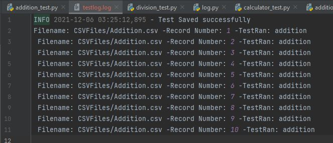
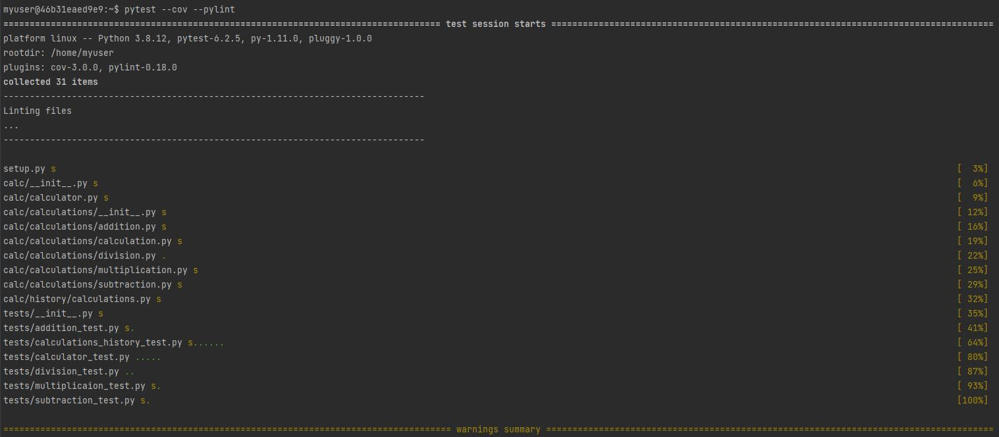
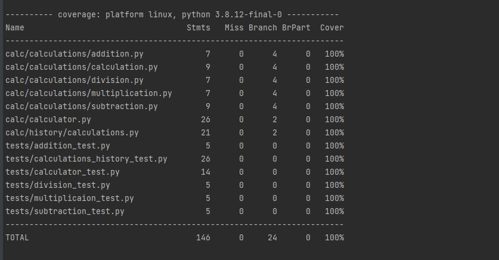

# Calculator Project Setup

Run Pip Install
pip install -r requirements.txt

To run tests, Lint, and Coverage report use this command:

pytest  --pylint --covs

.pylintrc is the config for pylint
.coveragerc is the config for coverage
setup.py is a config file for pytest

